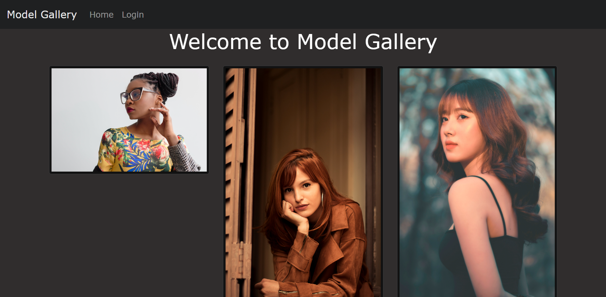
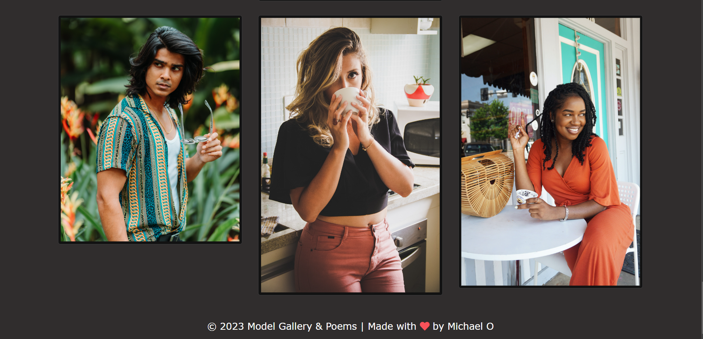
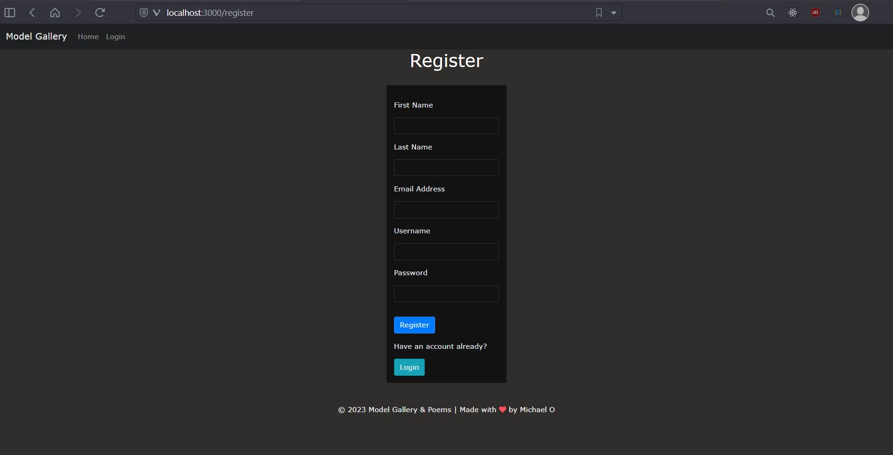
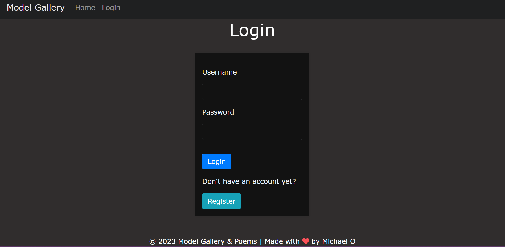
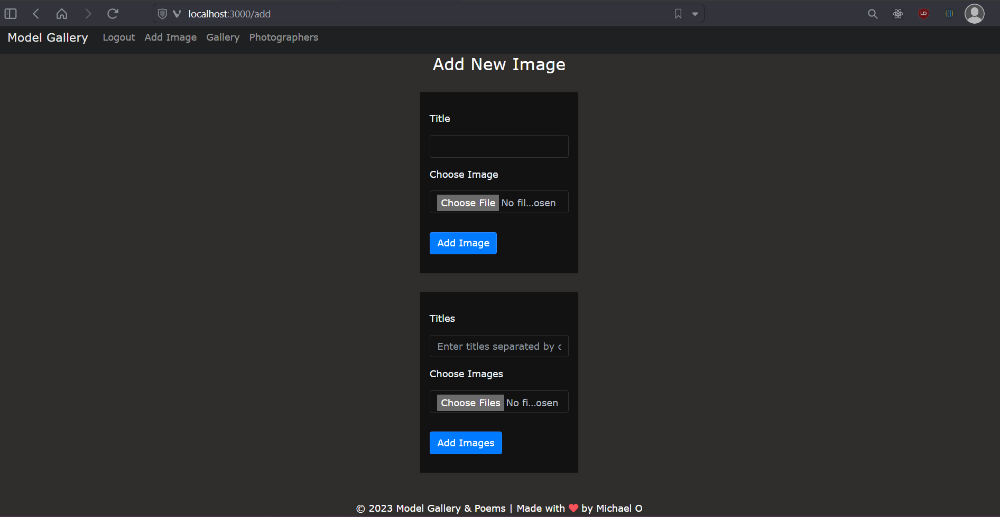
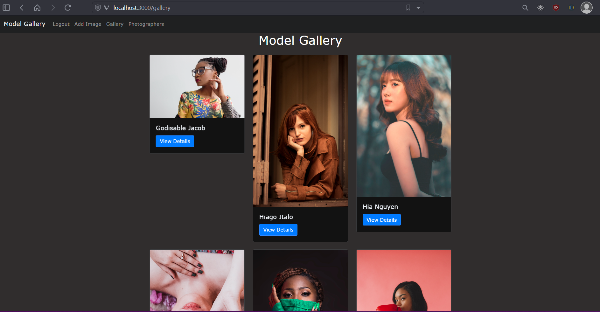
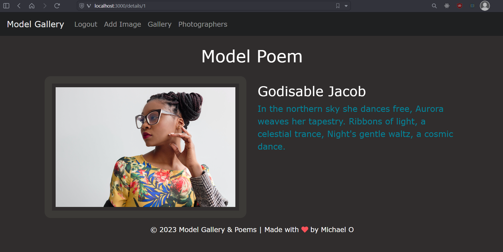
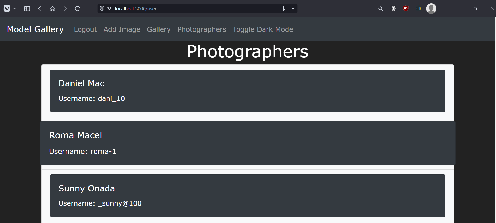

<div>
    <h1 class="header1">Model Gallery & Poems App<h1>
</div>

## Table Of Contents
1. [Description](#description)
2. [Added Features](#added-features)
3. [Screenshots](#screenshots)


<a id="description"><h3>Description</h3></a>
Model Gallery & Poem web application displays beautiful model images from [pexel](https://www.pexels.com) and interesting nature poems. This project was a further feature extension from the [sba_318_express_app](https://github.com/Michle99/sba_318_express_app) project.

The same pre-requisites from [sba_318_express_app](https://github.com/Michle99/sba_318_express_app) applies to this project. 


<a id="description"><h3>Added Features:</h3></a>
The following are the additional Routes, views, middlewares:

**Routes:**
```
app.use('/', indexRoutes);
app.use('/add', addRoutes);
app.use('/add/single', addRoutes);
app.use('/add/multiple', addRoutes);
app.use('/details', imageDetailsRoutes);
app.use('/gallery', galleryRoutes);
app.use('/login', loginRoutes);
app.use('/logout', logoutRoutes);
app.use('/register', registerRoutes);
app.use('/users', userRoutes);
```

**Middlewares:**
```
 middlewares/
 |-- errorHandler.js
 |-- isLoggedIn.js
```

<a id="description"><h3>Screenshots</h3></a>

- **Home Page:**



- **Register Page:**


- **Login:**


- **Add Image Page:**


- **Gallery Page:**


- **Details Page:**


- **Photographers Page:**



